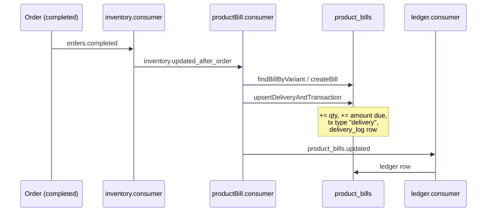

# Product-Based Billing

**This is the defining design decision in Sledje.** Read this before anything else in the
backend, because the schema, the event chain and the ledger all follow from it.

## The decision

Conventional B2B systems bill **per order**: every shipment produces an invoice, the retailer
owes per invoice, and payments are allocated against invoices.

Sledje bills **per product**. Credit is a running account per
**(retailer, distributor, variant)** — the `product_bills` table. There is one balance per SKU
per supplier, not one balance per order.

```
Conventional                          Sledje
------------                          ------
Order #1041  ->  ₹4,200 due           Parle-G 100g   ->  ₹1,850 due
Order #1055  ->  ₹3,100 due           Tata Salt 1kg  ->  ₹  920 due
Order #1072  ->  ₹2,700 due           Surf Excel 1kg ->  ₹7,230 due
```

## Why this is the right primitive

**1. Units are fungible across deliveries.** A shopkeeper who sold 20 packets of Parle-G this
week cannot tell you which shipment those 20 came from — and shouldn't have to. Order-based
billing forces exactly that allocation, because it needs to know which invoice to settle.
Product-based billing sidesteps it entirely: you owe for the Parle-G you sold, full stop.

**2. It matches the repayment model.** `README.md` defines distributor repayment as *"daily/
weekly payments to distributors based on sales of their products."* Once repayment is driven
by **sell-through** rather than by delivery, the product is the natural unit of account. The
order is an event that happened weeks ago and has no bearing on what is owed today.

**3. It matches the shopkeeper's mental model.** They think *"I owe for the Parle-G I've
sold"*, not *"I owe against invoice #4471"*. A system that asks a kirana owner to reconcile
invoices is a system they will stop using.

**4. It gives the distributor per-SKU credit exposure.** A distributor can see which products
are moving and which are sitting on the shelf financing themselves. Order-based bills cannot
answer that without joining through line items and reconstructing it.

**5. It composes with consignment terms.** Because the balance is per product, it is natural
to say "this SKU is on sale-or-return, that one is paid on delivery" — a per-relationship,
per-product policy. Order-based billing has to model that as invoice-level terms.

## The cost of the decision

Every design choice buys something and gives something up. Product-based billing gives up:

- **Cost layering for free.** An invoice records what you paid for a specific set of units. A
  running per-product balance does not, so if supplier prices move between deliveries the
  system must rebuild cost layers itself. Today it does not — see *Current state* below.
- **A natural payment unit.** "Pay invoice #4471" is obvious. "Pay ₹10,000 against your
  distributor" has to be *allocated* across many product bills by an explicit policy.
- **A natural statutory document.** GST requires a tax invoice at time of supply. A running
  product balance is not that document, which is why `invoices` exists alongside
  `product_bills`. They are not duplicates — see below.

## How it works today

### The three tables

| Table | Role |
|---|---|
| `product_bills` | The running account. One row per (retailer, distributor, variant). Holds `total_quantity_delivered`, `total_amount_due`, `total_amount_paid`, `outstanding_balance`, `current_unit_cost`. |
| `product_bill_transactions` | The movement log. Append-only. `type` is `delivery`, `return`, `payment` or `adjustment`. Each row carries `quantity`, `unit_price`, `amount`. |
| `product_delivery_log` | The reconciliation record. One row per (order, bill), protected by `unique uq_product_delivery_order_bill(order_id, product_bill_id)`. |

Note the shape: **the balance on `product_bills` is a cached aggregate; the truth is the
transaction log.** That is the correct instinct, and it is worth preserving.

### Idempotency by domain constraint

`uq_product_delivery_order_bill` is the mechanism that stops one order being billed twice
against the same product bill. This is the **best idempotency pattern in the codebase** — a
domain uniqueness constraint rather than message-level dedupe. The message-level dedupe
attempts elsewhere (`consumers/utils/dedupe.js`, `consumers/utils/js-consumer.js`) are both
non-functional; this one works because it is enforced by the database.

### The accrual path



Entry point: `backend/src/consumers/productBill.consumer.js`.
Repository: `backend/src/modules/product-bills/product-bills.repository.js`.

### Payment

`POST /product-bills/:billId/pay` → `product-bills.service.js:payBill`. In one transaction it
writes a `payment` transaction row and updates the bill's `total_amount_paid` up and
`outstanding_balance` down, then writes an `outbox` row `product_bills.payment`.

---

## Current state

The model is **half-implemented**. Sledje currently pays the full cost of product-based
billing while collecting none of its benefit.

### 1. Bills accrue on delivery, not on sale

`backend/src/consumers/productBill.consumer.js:10` subscribes to
`inventory.updated_after_order` and writes transactions with `type: "delivery"`. The liability
is created when goods are **received**.

But the whole justification for product-granular accounting is sell-through repayment — and
**the sell-through signal does not exist**. There is no `sales` table, no POS, no customer.
`inventory.dailyAvgSales` is written as the literal `0` in the only two code paths that touch
it (`modules/inventory/inventory.repository.js:50`, `consumers1/inventory.consumer.js:120`).

So today the system has product-granular accrual on a conventional trigger. That is strictly
harder than order-based billing with no compensating benefit. **The POS is what makes this
design pay off.** See [12-target-model.md](12-target-model.md).

### 2. `current_unit_cost` is overwritten on every delivery

`backend/src/modules/product-bills/product-bills.repository.js:61`:

```sql
current_unit_cost = ${unitCost}
```

Each delivery clobbers the previous cost. Consider:

- Receive 50 units @ ₹10 → `current_unit_cost = 10`
- Receive 50 units @ ₹12 → `current_unit_cost = 12`
- Retailer sells 60 units. **What do they owe?**

There is no answer, because the information needed to compute it has been destroyed. An
order-based system gets this free from the invoice. Product-based billing gave it up and must
rebuild it explicitly.

The raw material is already there: every `delivery` row in `product_bill_transactions` carries
its own `unit_price`. It is simply never used for costing. The fix is FIFO cost layers — see
[12-target-model.md](12-target-model.md).

### 3. Payment has no allocation path

`POST /product-bills/:billId/pay` is the only payment entry point. A retailer settling ₹10,000
against a distributor with 200 SKUs must split it across bills by hand.

This is a **presentation and allocation gap, not a modelling error**. Product bills should stay
the ledger of record; what is missing is a party-level roll-up view and an allocation engine
that spreads a lump sum across bills under a policy.

### 4. `payBill` does not clamp to outstanding

`modules/product-bills/product-bills.service.js:payBill` does not clamp the payment against
`outstanding_balance`, so an overpayment drives the balance negative. The parallel
implementation in `modules/payments/payments.service.js:payBill` *does* clamp — and also writes
a `ledger` row, which the product-bills one does not. Two divergent implementations of the same
operation are exposed on two different routers (only one of which is mounted).

### 5. The update path builds SQL by string interpolation

Both `product-bills.repository.js` and `payments.repository.js` construct their `UPDATE`
statements with template interpolation of `amount`, `qty` and `unitCost` — values that arrive
directly from request bodies. See [10-known-issues.md](10-known-issues.md).

### 6. `product_bills` has no foreign keys and no uniqueness

`retailer_id`, `distributor_id` and `variant_id` are plain `uuid` columns with **no references**
(`backend/src/db/schema.js:416-418`), and there is no unique constraint on the triple. The
find-or-create in `productBill.consumer.js` can therefore race into duplicate bill rows for the
same product, silently splitting a balance in two.

---

## Product bills vs invoices

These look redundant. They are not — they are two different events, and the tension between
them is real and currently unresolved.

| | `product_bills` | `invoices` |
|---|---|---|
| Represents | Commercial reality: what the retailer owes | Statutory document: GST tax invoice |
| Grain | Per (retailer, distributor, variant) | Per (retailer, distributor, period) |
| Timing | Continuous, accrues per movement | Periodic — weekly or monthly |
| Written by | The event chain | `invoices.service.js` on demand, or `settlement.worker.js` on a schedule |

GST requires a tax invoice at **time of supply**. Commercial liability under a sell-through
model accrues at **time of sale**. Those are genuinely different events, so two objects are
correct. What is missing is:

1. A decision on which is the legal document of record.
2. Reconciliation between them — nothing currently checks that the sum of invoiced amounts
   agrees with the sum of billed amounts for a period.
3. Consistent GST logic. `invoices.service.js:generateInvoice` always splits GST 50/50 into
   CGST/SGST with `igst: 0`. `workers/settlement.worker.js` correctly applies place-of-supply
   rules (IGST when `retailer.state !== distributor.state`). **The more correct implementation
   is the one that cannot run.**

---

## Worked example

The example every implementation should be checked against.

**Setup** — retailer R, distributor D, variant V (Parle-G 100g).

| Step | Event | Effect |
|---|---|---|
| 1 | Receive 50 units @ ₹10 | Layer 1: 50 @ ₹10 = ₹500 |
| 2 | Receive 50 units @ ₹12 | Layer 2: 50 @ ₹12 = ₹600 |
| 3 | Sell 60 units | FIFO: consume 50 from Layer 1 (₹500) + 10 from Layer 2 (₹120) |
| 4 | Pay ₹500 | Applied against the amount due |

**Resulting position:**

```
Total received:        100 units, ₹1,100
Sold (accrued due):     60 units, ₹  620      (500 + 120)
Unsold (not yet due):   40 units, ₹  480      (40 @ ₹12, remainder of Layer 2)
                                  --------
Check:                  ₹620 + ₹480 = ₹1,100  ✓

Amount due:             ₹620
Amount paid:            ₹500
Outstanding (due):      ₹120
Consignment held:       ₹480     (distributor-financed, not yet payable)
Total exposure to D:    ₹600     (₹120 + ₹480)
```

Two numbers the current implementation cannot produce:

- **₹620** — because `current_unit_cost` was overwritten to ₹12, it would compute 60 × ₹12 =
  ₹720, overcharging the retailer by ₹100.
- **₹480 vs ₹120** — the split between *unsold consignment* and *payable debt* does not exist;
  today everything received is immediately due.

The target model resolves both. See [12-target-model.md](12-target-model.md).
