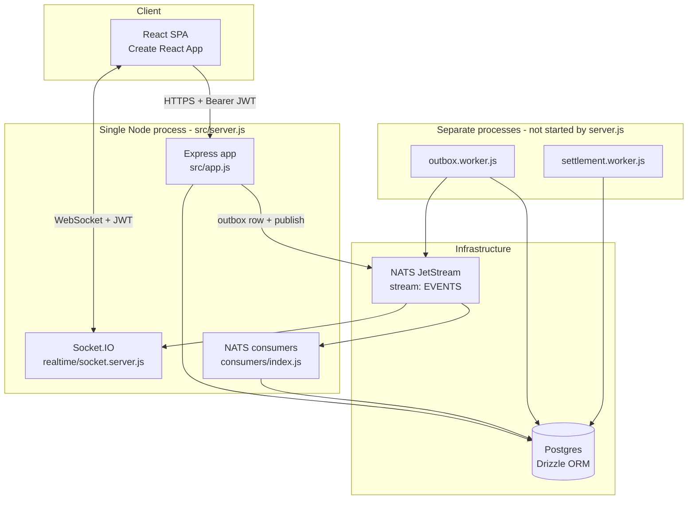

# Architecture

> **Partially superseded.** The boot sequence and consumer-layer sections below describe the
> pre-Stage-0 system. `startAllConsumers()` and `src/consumers/` no longer exist; NATS init
> failure no longer kills the server (`server.js` degrades gracefully); delivery, billing and
> ledger effects now happen synchronously in one transaction. See
> [10-known-issues.md](10-known-issues.md) for what changed and
> [06-events.md](06-events.md) for the same caveat on the event layer.

## Shape

An event-driven modular monolith. One Node process serves the HTTP API, the Socket.IO realtime
layer **and** all NATS consumers. Two more processes are meant to run separately (an outbox
worker and a settlement worker).



## Boot sequence

`backend/src/server.js:11-36`:

1. `import "dotenv/config"`
2. `await initNats()` — connect to NATS. **A failure here kills the process**; the API cannot
   start without NATS.
3. `http.createServer(app)`
4. `startSocketServer(server)` — this also calls `ensureEventsStream()`, so **the JetStream
   `EVENTS` stream is created as a side effect of starting the realtime layer**, not at boot.
5. `startAllConsumers()` — note the comment says `MUST await` and it **is not awaited**
   (`server.js:23`). Consumer startup failures are unhandled.
6. `server.listen(PORT)`

There is no health endpoint, no graceful shutdown, and no readiness gate.

## Middleware

`backend/src/app.js:28-29` — the entire middleware stack:

```js
app.use(cors());
app.use(express.json());
```

Consequences worth knowing before you debug anything:

- **There is no error-handling middleware anywhere in the codebase.** Every controller's
  `next(err)` falls through to Express's default handler, which returns an HTML 500 page with
  a stack trace. A service that does `throw new Error("Forbidden")` produces a **500, not a
  403** — so authorisation failures are indistinguishable from crashes.
- **`cors()` is unrestricted.** No origin allowlist. `CLIENT_ORIGIN` is read by the socket
  server but never by the HTTP layer.
- **There is no request validation.** `backend/src/api-gateway/middlewares/validate.js` is a
  zero-byte file. No zod, joi or express-validator anywhere. Controllers pass `req.body`
  straight into services.
- **There is no central config layer.** `backend/src/config/env.js` is a zero-byte file. Every
  module reads `process.env` directly, with its own defaults.
- No `helmet`, no rate limiting, no request logging.

## Layering

The intended convention:

```
api-gateway/routes/*.routes.js       HTTP method + path + middleware
        |
api-gateway/controllers/*.controller.js   req/res handling only
        |
modules/<m>/<m>.service.js           business rules, transactions, events
        |
modules/<m>/<m>.repository.js        Drizzle queries
        |
config/postgres.js                   the shared db handle
```

**Adhered to:** `products`, `distributor-inventory`, `distributorships`, `cart`, `orders`,
`product-bills`, `retailers`, `distributors`, `auth`.

**Bypasses the repository layer** (services query `db` directly): `connections`, `invoices`
(has no repository at all), `ledger` (partially), `notifications` (has an empty repository
file), `orders` (partially).

When adding code, follow the convention. When reading code, do not assume it.

## Authentication

`backend/src/api-gateway/middlewares/auth.middleware.js` exports `requireAuth`. It reads the
`Authorization` header, splits on a space, takes index `[1]`, verifies via
`AuthService.verifyToken`, and sets:

```js
req.user = { id, role, iat, exp }
```

**`id` is `users.id` — not `retailers.id` or `distributors.id`.** This is load-bearing and
causes two live bugs:

- Every service must re-resolve the profile row on every request (`findRetailerByUserId` /
  `findDistributorByUserId`), an extra query per call.
- `modules/ledger/ledger.repository.js` filters on `user.entityId`, which is never set, so
  those queries always filter on `undefined`.
- `realtime/socket.server.js` joins rooms keyed `user:<users.id>` but event payloads carry
  `retailerId` / `distributorId` (profile ids), so targeted delivery never matches. See
  [06-events.md](06-events.md).

There is **no role-based middleware**. Role checks are ad hoc inside controllers and services
(`if (user.role !== "retailer") throw new Error(...)`), and since there is no error middleware,
those throws become 500s.

## Module inventory

| Module | Responsibility | Health |
|---|---|---|
| `auth` | Register, login, JWT, OTP reset | ⚠️ Login/register fine; OTP reset broken |
| `retailers` | Retailer profile read/update | ✅ |
| `distributors` | Distributor profile read/update | ✅ |
| `connections` | Request → approve → connection; discovery | ⚠️ `searchDistributors` throws |
| `distributorships` | Catalogue namespaces | ⚠️ `getWithProducts` throws |
| `products` | Shared catalogue, bulk import | ⚠️ Reads work; all writes broken at the controller |
| `inventory` (retailer) | Retailer shelf | ❌ Writes columns the table does not have |
| `inventory` (distributor) | `distributor-inventory.*` — stock and prices | ✅ Healthiest module |
| `cart` | Cart CRUD + checkout | ⚠️ CRUD fine; checkout broken and unused |
| `orders` | Order lifecycle and state machine | ❌ Creation throws; logic otherwise sound |
| `product-bills` | Per-product credit accounts | ⚠️ See [02-product-billing.md](02-product-billing.md) |
| `payments` | Parallel bill/gateway implementation | ❌ Routes unmounted; calls missing repo methods |
| `ledger` | Debit/credit statement | ⚠️ Two of five endpoints broken |
| `invoices` | GST invoice generation and PDF | ⚠️ `POST /generate` misrouted |
| `notifications` | User notifications | ❌ Two endpoints throw; nothing writes rows |
| `outbox` | Outbox drain worker | ⚠️ Competes with a consumer doing the same job |

## Infrastructure requirements

| Component | Required? | Notes |
|---|---|---|
| Postgres | **Yes** | Everything |
| NATS + JetStream | **Yes** | `initNats()` failure kills boot |
| Socket.IO | In-process | Path `/socket.io` |
| SMTP | Optional | OTP mail; falls back to `console.log` |
| Google Drive service account | Optional | `service-account.json` at cwd, for `/api/upload` |
| Redis | **Not used** | Despite what you might expect from the architecture |

## Duplicate and dead code

The codebase contains two of several things. When you find a file, check whether it is the live
one:

| Concept | Live | Dead |
|---|---|---|
| Socket server | `src/realtime/socket.server.js` | `backend/realtime/socket.server.js` (broken imports) |
| Event publisher | both used, ~60/40 | `config/nats-streams.js` (swallows errors) vs `events/jetstream.js` (rejects) |
| Outbox drain | `consumers/outbox.consumer.js` | `modules/outbox/outbox.worker.js` — **both work, differently** |
| Consumers | `src/consumers/` | `src/consumers1/` (broken import paths) |
| Invoice PDF | `utils/invoice-pdf.js` | `utils/invoicePdf.js` |
| Email | `modules/auth/email.service.js` (SMTP_*) | `utils/email.js` (MAIL_*) — unused |
| Payments controller | `payments.controller.js` | `paments.controrer1.js` (filename typo) |
| Dedupe | neither works | `consumers/utils/dedupe.js` and `consumers/utils/js-consumer.js` |

Zero-byte files: `config/env.js`, `utils/jwt.js`, `api-gateway/middlewares/validate.js`,
`modules/notifications/notifications.events.js`,
`modules/notifications/notifications.repository.js`.

Unused-but-functional: `utils/otp.js` (auth inlines its own OTP generation instead).
