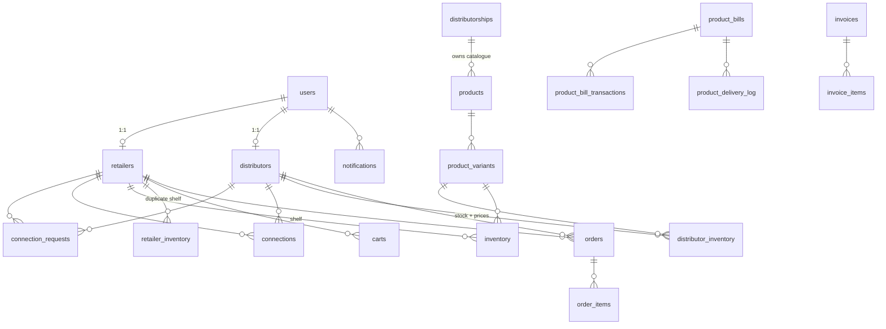

# Data Model

**Authoritative source:** `backend/src/db/schema.js` (Drizzle, 26 tables).
`drizzle.config.js` points at it. Verified: `drizzle/meta/0002_snapshot.json` matches it
table-for-table and column-for-column — **there is no schema↔migration drift**.

> ⚠️ **`backend/src/db/schema.sql` is stale and contradicts the live schema.** It is a
> Knex-era artifact still describing `bills`, `products.distributor_id`,
> `product_variants.stock` and CHECK constraints that do not exist. Treat it as historical
> only. Same for `backend/src/db/migrations/20251118171753_create_users.js`.

## Conventions

- All primary keys are `uuid ... defaultRandom()` **except** `event_dedupe.event_id`, which is
  `text`.
- All timestamps are `timestamp` **without** time zone.
- **There are no Postgres enums.** Every "enum" is a plain `text` column with permitted values
  recorded only in a code comment. Nothing enforces them.
- Column naming is snake_case, **except** `ledger.billId` which maps to the physical column
  `"productBillId"` (`schema.js:366`).

## Relationship overview

Soft references (no FK enforced) are drawn as ownership above but are **not** constrained in
the database: everything on `product_bills`, `invoices`, `invoice_items`,
`inventory_snapshots`, `notifications_log`, and `ledger`'s `order_id` / `productBillId` /
`reference_id`.

---

## Identity

### `users` — `schema.js:18`
| Column | Type | Notes |
|---|---|---|
| `id` | uuid PK | |
| `role` | text NOT NULL | `retailer` \| `distributor` — comment only, no CHECK |
| `email` | text NOT NULL UNIQUE | `users_email_unique` |
| `password` | text NOT NULL | bcrypt, 10 rounds |
| `phone` | text NOT NULL | |
| `created_at` | timestamp | default now |

### `retailers` — `schema.js:34`
`id` uuid PK · `user_id` uuid **UNIQUE** → `users.id` CASCADE · `business_name` text NOT NULL ·
`owner_name` text NOT NULL · `gst_number` text · `business_type` text NOT NULL · `pincode` text
NOT NULL · `state` text *(drives GST intra/inter-state logic)* · `location` text · `address`
text · `profile_picture_url` text · `created_at` timestamp.

### `distributors` — `schema.js:60`
Identical to `retailers` except `company_name` replaces `business_name`.

> These two tables are ~90% the same columns. See [11-design-critique.md](11-design-critique.md).

---

## Connections

### `connection_requests` — `schema.js:86`
`id` uuid PK · `retailer_id` → `retailers.id` CASCADE · `distributor_id` → `distributors.id`
CASCADE · `status` text default `'pending'` (`pending|approved|rejected`) · `message` text ·
`rejection_reason` text · `created_at`.

**No unique constraint on (retailer, distributor)** — duplicates are prevented only in
application code.

### `connections` — `schema.js:108`
`id` uuid PK · `retailer_id` → `retailers.id` CASCADE · `distributor_id` → `distributors.id`
CASCADE · `created_at`.
**UNIQUE `uq_connection_pair` (retailer_id, distributor_id)**.

---

## Catalogue

### `distributorships` — `schema.js:132`
`id` uuid PK · `name` text NOT NULL **UNIQUE** · `description` text · `created_at`.

### `products` — `schema.js:144`
`id` uuid PK · `distributorship_id` uuid **NOT NULL** → `distributorships.id` CASCADE ·
`name` text NOT NULL · `image_url` text · `category` text · `subcategory` text · `created_at`.

> Products belong to a **distributorship**, not to a distributor. Changed in migration `0001`.

### `product_variants` — `schema.js:165`
`id` uuid PK · `product_id` → `products.id` CASCADE · `name` text NOT NULL ·
`sku` text NOT NULL **UNIQUE** · `mrp` numeric(10,2) default `'0'` · `unit` text ·
`hsn_code` text · `gst_rate` numeric(5,2) default `'0'` · `is_tax_inclusive` boolean default
false · `created_at`.

**Carries no stock and no price** — deliberately. Those are per-distributor.

> `sku` is unique **globally**, across all distributorships. SKUs are vendor-local in reality,
> so two suppliers using "1001" will collide. There is also no barcode/EAN column.

---

## Stock

### `distributor_inventory` — `schema.js:189`
`id` uuid PK · `distributor_id` uuid NOT NULL → `distributors.id` CASCADE ·
`variant_id` uuid NOT NULL → `product_variants.id` CASCADE · `stock` integer default 0 ·
`selling_price` numeric(10,2) default `'0'` · `cost_price` numeric(10,2) default `'0'` ·
`expiry` timestamp · `low_stock_threshold` integer default 5 · `created_at`.

**No unique on (distributor_id, variant_id)** — enforced only by the select-then-insert in
`distributor-inventory.repository.js:upsertInventory`.

### `inventory` — `schema.js:224` (retailer shelf)
`id` uuid PK · `retailer_id` → `retailers.id` CASCADE · `variant_id` → `product_variants.id`
CASCADE · `qty` integer NOT NULL default 0 · `reorder_level` integer default 5 ·
`expiry` timestamp · `daily_avg_sales` numeric(10,2) default `'0'` · `last_updated` timestamp.

The `UNIQUE(retailer_id, variant_id)` present in the legacy `schema.sql` was **not** carried
into Drizzle.

### `retailer_inventory` — `schema.js:636` (second retailer shelf)
`id` uuid PK · `retailer_id` → `retailers.id` · `variant_id` → `product_variants.id` ·
`quantity` integer default 0 · `updated_at`.

Written only by `consumers/inventory.consumer.js`, append-only (never upserts). **Duplicates
`inventory`.** A genuine modelling conflict, not just redundancy.

### `inventory_snapshots` — `schema.js:598`
`id` uuid PK · `retailer_id` uuid NOT NULL · `variant_id` uuid NOT NULL · `stock` integer NOT
NULL default 0 · `snap_date` timestamp NOT NULL. **No code reads or writes this table.**

---

## Ordering

### `carts` — `schema.js:255`
`id` uuid PK · `retailer_id` → `retailers.id` CASCADE · `variant_id` → `product_variants.id` ·
`distributor_id` → `distributors.id` · `quantity` integer NOT NULL · `unit` text ·
`price` numeric(10,2) · `created_at`.

One row per line item. A cart spanning several distributors is split into one order each at
checkout.

### `orders` — `schema.js:276`
`id` uuid PK · `order_number` text NOT NULL **UNIQUE** · `retailer_id` → `retailers.id` ·
`distributor_id` → `distributors.id` · `status` text NOT NULL default `'pending'` ·
`total_amount` numeric(12,2) NOT NULL · `notes` text · `expected_delivery` timestamp ·
`created_at` · `updated_at` · `accepted_at` · `delivered_at` · `completed_at`.

Status values: comment says `pending|modified|processing|cancelled|completed`;
`orders.service.js:updateOrderStatus` additionally permits `sent` and `delivered`.
The three audit timestamps are **declared but never written by any code**.

### `order_items` — `schema.js:305`
`id` uuid PK · `order_id` → `orders.id` CASCADE · `variant_id` → `product_variants.id` ·
`product_name` text · `variant_name` text · `sku` text · `quantity` integer NOT NULL ·
`unit` text · `variant_selling_price` numeric(10,2) · `created_at`.

Denormalised snapshot of the line at order time — correct, since catalogue data can change.

---

## Money

### `product_bills` — `schema.js:411`
The central credit object. See [02-product-billing.md](02-product-billing.md).

| Column | Type | Notes |
|---|---|---|
| `id` | uuid PK | |
| `retailer_id` | uuid NOT NULL | **no FK** |
| `distributor_id` | uuid NOT NULL | **no FK** |
| `variant_id` | uuid NOT NULL | **no FK** |
| `outstanding_balance` | numeric(14,2) default `'0'` | |
| `total_amount_paid` | numeric(14,2) default `'0'` | |
| `total_amount_due` | numeric(14,2) default `'0'` | |
| `total_quantity_delivered` | integer default 0 | |
| `current_unit_cost` | numeric(12,2) default `'0'` | **overwritten on each delivery** |
| `last_transaction_date` | timestamp | |
| `meta` | jsonb | |
| `created_at` / `updated_at` | timestamp | |

INDEX `idx_product_bills_retailer_variant` (retailer_id, variant_id).
**No unique on the (retailer, distributor, variant) triple** that the find-or-create assumes.

### `product_bill_transactions` — `schema.js:456`
`id` uuid PK · `product_bill_id` uuid NOT NULL → `product_bills.id` CASCADE · `date` timestamp
default now · `quantity` integer default 0 · `unit_price` numeric(12,2) default `'0'` ·
`amount` numeric(14,2) default `'0'` · `type` text NOT NULL (`delivery|return|payment|adjustment`)
· `metadata` jsonb.

### `product_delivery_log` — `schema.js:474`
`id` uuid PK · `order_id` uuid NOT NULL *(no FK)* · `product_bill_id` uuid NOT NULL →
`product_bills.id` CASCADE · `variant_id` uuid NOT NULL *(no FK)* · `quantity_delivered`
integer NOT NULL default 0 · `unit_cost` numeric(12,2) default `'0'` · `created_at`.
**UNIQUE `uq_product_delivery_order_bill` (order_id, product_bill_id)** — the idempotency
guard for the billing chain.

### `ledger` — `schema.js:355`
`id` uuid PK · `retailer_id` → `retailers.id` · `distributor_id` → `distributors.id` ·
`type` text NOT NULL (`debit|credit`) · `amount` numeric(10,2) NOT NULL ·
`balance` numeric(10,2) NOT NULL · `order_id` uuid *(no FK)* ·
**`billId` → physical column `"productBillId"`** *(no FK)* · `reference_type` text ·
`reference_id` uuid · `created_at`.

`type`, `amount` and `balance` are all NOT NULL — which is why
`consumers/ledger.consumer.js` fails on every insert.

### `invoices` — `schema.js:502`
`id` uuid PK · `retailer_id` uuid NOT NULL *(no FK)* · `distributor_id` uuid NOT NULL *(no FK)*
· `period_start` / `period_end` timestamp NOT NULL · `currency` text default `'INR'` ·
`gst_number` text · `place_of_supply` text · `invoice_number` text *(**never populated**)* ·
`total_taxable_value` / `total_gst` / `cgst` / `sgst` / `igst` numeric(14,2) ·
`total_amount` numeric(14,2) NOT NULL default `'0'` · `status` text NOT NULL default `'draft'`
(`draft|issued|paid|partial`) · `created_at` / `updated_at` · `metadata` jsonb.

INDEX `idx_invoices_retailer_distributor`.
**UNIQUE `uq_invoice_period` (retailer_id, distributor_id, period_start, period_end)** — the
idempotency guard for settlement.

### `invoice_items` — `schema.js:556`
`id` uuid PK · `invoice_id` uuid NOT NULL → `invoices.id` CASCADE · `product_bill_id` uuid NOT
NULL *(no FK)* · `variant_id` uuid NOT NULL *(no FK)* · `quantity` integer NOT NULL default 0 ·
`unit_price` numeric(12,2) NOT NULL default `'0'` · `hsn_code` text · `taxable_value` / `cgst` /
`sgst` / `igst` numeric(14,2) · `amount` numeric(14,2) NOT NULL default `'0'` · `metadata` jsonb
· `created_at`. INDEX `idx_invoice_items_invoice_id`.

> Money precision is inconsistent across the schema: `numeric(10,2)`, `(12,2)` and `(14,2)`
> are all used for amounts, and JavaScript reads them as strings then does `Number()`
> arithmetic on them.

---

## Sell side and offline sync

> **Doc gap:** this page was written before the POS existed and still describes the schema as
> of migration `0002`. The sell-side tables added by `0006_pos_delivery_agents_two_stage`
> (`customers`, `retail_prices`, `sales`, `sale_items`, `sale_payments`, `product_bill_layers`,
> `delivery_agents`, `deliveries`) are **not documented above**. `backend/src/db/schema.js`
> remains the authority. What follows covers only what `0008_offline_sync` changed or added.

### `sales` — `schema.js:822`
**`id` varchar(26) PK — a ULID minted on the DEVICE, not the server.** `retailer_id` →
`retailers.id` CASCADE · `customer_id` → `customers.id` *(null = walk-in)* · `bill_number` text
NOT NULL · `device_id` varchar(26) *(null for sales made through `POST /sales`)* · `sold_at`
timestamp NOT NULL *(the device clock at the counter — the business fact)* · `synced_at`
timestamp *(when the server first heard about it)* · `subtotal` / `tax_total` / `discount` /
`total` numeric(12,2) · `status` text default `'completed'` (`completed | voided`) ·
`voided_at` timestamp · `void_reason` text · `created_at`.
UNIQUE `uq_sale_bill` (retailer_id, bill_number) · INDEX `idx_sales_retailer_date`.

`sale_items.id` / `sale_payments.id` and their `sale_id` FKs are `varchar(26)` for the same
reason: the lines exist on the device before they exist here.

### `sync_devices` — `schema.js`
`id` varchar(26) PK *(device ULID, minted on the device)* · `retailer_id` → `retailers.id`
CASCADE · `device_code` text NOT NULL *(the six-character bill-number prefix)* · `label` text ·
`last_cursor` / `last_seen_at` / `created_at` timestamps.
UNIQUE `uq_sync_device_code` (retailer_id, device_code) — the one thing a device cannot detect
alone is another till of the same shop already using its prefix.

### `sync_ops` — `schema.js`
`id` uuid PK · `device_id` varchar(26) NOT NULL · `op_id` varchar(26) NOT NULL · `retailer_id`
→ `retailers.id` CASCADE · `type` text NOT NULL (`sale.create | sale.void | price.set`) ·
`op_at` timestamp *(device clock)* · `applied_at` timestamp · `result` jsonb.
**UNIQUE `uq_sync_op` (device_id, op_id)** · INDEX `idx_sync_ops_retailer`.

`uq_sync_op` is the exactly-once guarantee for the whole sync protocol: a replayed batch loses
the race to insert and is acknowledged rather than reapplied. It is a database constraint and
not an in-memory cache because a cache survives neither a restart, a second process, nor a
deploy — and "the shop's sales were counted twice because we redeployed" is not a recoverable
class of bug. Same discipline as `uq_product_delivery_order_bill`
([02-product-billing.md](02-product-billing.md)).

`result` stores what the *first* application returned, so a replay can be answered with the
real outcome — notably the bill number, which the server may have had to disambiguate.

### Changed by `0008`

* `ledger.reference_id` `uuid` → **`text`**. It is a polymorphic reference (invoice, payment,
  adjustment, **sale**) and cannot be narrower than the widest id it points at.
* `product_bill_transactions` gains `idx_pbt_sale` on `(metadata ->> 'saleId')`, partial on
  `metadata ? 'saleId'`. Accrual rows now carry their FIFO layer breakdown in `metadata`, and
  a void reverses exactly those layers.

---

## Infrastructure tables

### `outbox` — `schema.js:379`
`id` uuid PK · `event_type` text NOT NULL · `payload` jsonb NOT NULL · `published` boolean
default false · `created_at`. INDEX `idx_outbox_published` (published).

> `modules/outbox/outbox.service.js:markFailed` writes to an `error` column that **does not
> exist**.

### `otp_codes` — `schema.js:397`
`id` uuid PK · `email` text NOT NULL · `otp` text NOT NULL · `expires_at` timestamp NOT NULL ·
`created_at`. No FK to `users`; lookup is by email.

### `event_dedupe` — `schema.js:612`
`event_id` **text PRIMARY KEY** · `processed_at` timestamp default now.
Used by `consumers/utils/dedupe.js`. Note `consumers/utils/js-consumer.js` instead queries a
table `event_dedup` with a column `message_id` — **neither exists**.

### `notifications` — `schema.js:333`
`id` uuid PK · `user_id` → `users.id` CASCADE · `title` / `message` / `type` text ·
`entity_id` uuid *(no FK)* · `actor_id` uuid *(no FK)* · `read` boolean default false ·
`created_at`.

### `notifications_log` — `schema.js:622`
`id` uuid PK · `user_id` uuid *(no FK)* · `title` / `body` / `event_type` text · `created_at`.
**Never written.**

---

## Migrations

`backend/drizzle/meta/_journal.json` — version 7, postgresql, nine entries.

| Migration | Date | What it does |
|---|---|---|
| `0000_spotty_texas_twister` | 2025-11-20 | Baseline: 21 tables. `products` had `distributor_id`, `icon`, `reorder_level`; `product_variants` had `stock`, `selling_price`, `cost_price`, `expiry`. |
| `0001_cool_lord_tyger` | 2025-11-26 | **The domain remodel.** Creates `distributorships`, `distributor_inventory`, `retailer_inventory`, `event_dedupe`, `notifications_log`. Moves products from distributor to distributorship. **Drops `product_variants.stock`, `.selling_price`, `.cost_price`, `.expiry`** — stock and pricing move to `distributor_inventory`. |
| `0002_oval_doctor_octopus` | 2025-11-27 | Additive: `distributor_inventory.low_stock_threshold`, `distributors.profile_picture_url`, `retailers.profile_picture_url`, `product_variants.mrp`. |
| `0003` … `0007` | — | Delivery codes, outbox error column, product-bill FKs and `uq_product_bill`, the POS / delivery-agent / two-stage-billing schema, and dropping `current_unit_cost`. **Not yet documented on this page.** |
| `0008_offline_sync` | 2026-09-08 | Offline POS. `sales` / `sale_items` / `sale_payments` ids `uuid` → `varchar(26)` (client ULIDs, converted with `USING id::text` so existing rows keep their identity); `sales` gains `device_id`, `synced_at`, `voided_at`, `void_reason`; `ledger.reference_id` → `text`; creates `sync_devices` and `sync_ops`; adds `idx_pbt_sale`. Hand-adjusted from drizzle-kit's diff — the generator emitted the child FK's type change before the parent's, which Postgres rejects. |

> ⚠️ Migration `0001` contains `ALTER TABLE "products" ADD COLUMN "distributorship_id" uuid
> NOT NULL` with no default. **This fails on a non-empty `products` table.** A database with
> pre-`0001` product data cannot migrate forward without a manual backfill step.

**Migration `0001` is the source of most schema drift in the code.** Five modules still read
`product_variants.stock`, `.sellingPrice` and `.costPrice` — columns dropped over a year ago.
See [10-known-issues.md](10-known-issues.md).
