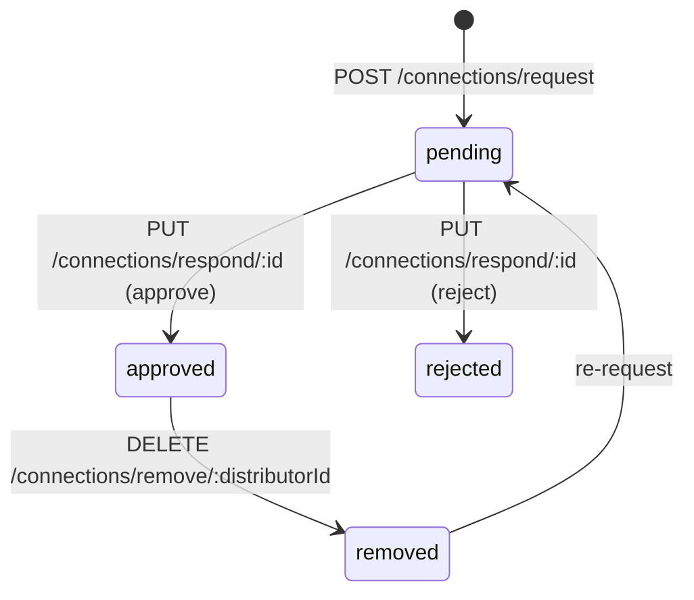
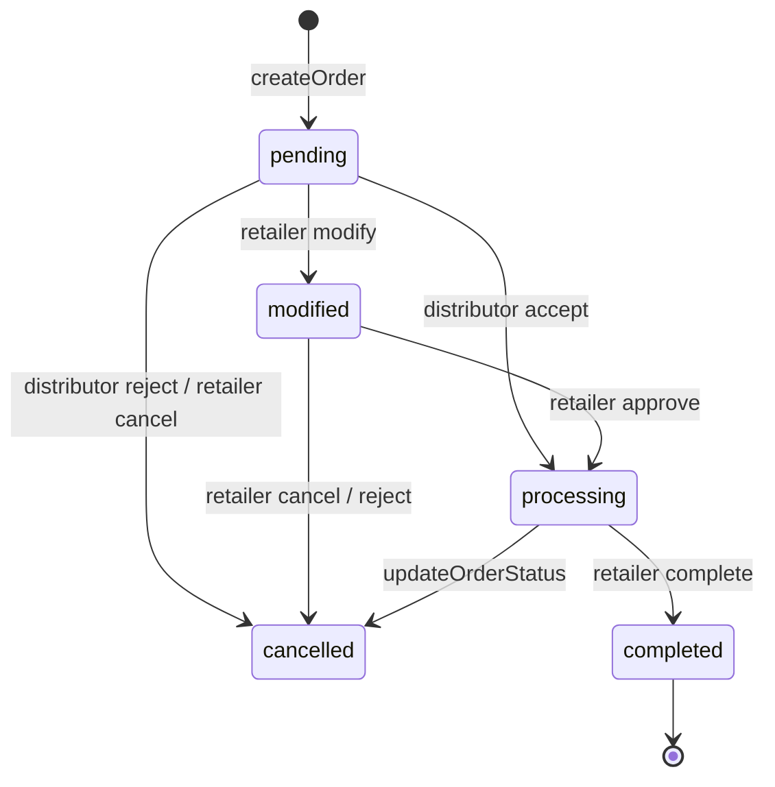

# Domain Flows

End-to-end lifecycles. Each section gives the code path first, then the current state.

---

## 1. Registration and login

`modules/auth/auth.service.js`

One transaction inserts `users` (bcrypt, 10 rounds) → `retailers` or `distributors` with the
`user_id` → an `outbox` row `users.registered`. A JWT `{ id, role }` is signed (7-day default),
and `publishUserRegistered` fires best-effort.

Login verifies the password **and** that `user.role` matches the endpoint — a retailer cannot
log in at `/distributors/login`. Returns the token plus the joined profile row.

Two entry points exist for each role: `/auth/distributors/*` and `/distributors/*` are the same
handlers. Retailers only have `/retailers/*`.

**Current state:** ✅ Working.

---

## 2. Password reset (OTP)

`forgotPassword` writes a 6-digit OTP to `otp_codes` with `expires_at = now + 10 min` and mails
it via `modules/auth/email.service.js` (falls back to `console.log` when SMTP is unset).
`verifyOtp` and `resetPassword` read it back and update the password.

**Current state:** ❌ **Broken.** `auth.repository.js` uses `users.id.eq(id)` (lines 29, 50, 70,
92) — not the Drizzle API — and `getValidOtp` does `db.select().from(sql\`otp_codes\`)`, which is
also invalid. Both `verifyOtp` and `resetPassword` throw.

Note also that `forgotPassword` inlines `Math.random()`-based OTP generation and a hardcoded
10-minute TTL, while `utils/otp.js` provides a crypto-random `generateOtp()` and
`otpExpiryDate()` honouring `OTP_TTL_MINUTES`. The good implementation is unused.

---

## 3. Connecting a retailer to a distributor



1. Retailer calls `POST /connections/request`. The service maps `users.id → retailers.id`,
   returns any existing `pending`/`approved` request (deduplication in application code only —
   there is no unique constraint), otherwise inserts `connection_requests` with
   `status = 'pending'` and publishes `connections.requested`.
2. Distributor lists via `GET /connections/distributor/requests`.
3. `PUT /connections/respond/:requestId`:
   - **approve** → sets `status = 'approved'` **and** inserts a `connections` row (guarded by
     `uq_connection_pair`), publishes `connections.approved`.
   - **reject** → sets `status = 'rejected'` + `rejection_reason`, publishes
     `connections.rejected`.
4. Discovery: `suggestedDistributors` / `suggestedRetailers` match on identical `pincode` and
   decorate each row with `requestStatus` and `connectionStatus`.

**Current state:** ⚠️ Mostly working, with two defects:

- **Approve is not transactional.** The status update and the `connections` insert are two
  separate statements. A failure between them leaves an approved request with no connection.
- **`removeConnection` deletes only the `connections` row.** The approved
  `connection_requests` row survives, so a subsequent re-request finds the stale approved
  request and returns it instead of creating a new one — the retailer can never reconnect
  through the normal path.
- `searchDistributors` throws `ReferenceError: company is not defined`
  (`connections.repository.js:183` contains a stray identifier).

---

## 4. Catalogue → distributorship → distributor inventory

The clearest expression of the data model. Three ways in:

**a. Manual, per product** — `POST /api/distributorships` creates (or returns by name) a
distributorship; `POST /products/add` inserts `products` + `product_variants`. No stock, no
price.

**b. Import an existing variant** — `POST /api/distributor-inventory/import` upserts a
`distributor_inventory` row for a catalogue variant the distributor now stocks.

**c. Bulk CSV/XLSX** — `POST /products/bulk-upload` →
`products.service.js:bulkImportForDistributor`. Row columns:

```
distributorshipName, productName, variantName, sku, mrp, unit,
hsnCode, gstRate, stock, costPrice, sellingPrice, expiry
```

Pipeline: find-or-create distributorship → find-or-create product in it → find-or-create
variant by sku → `DistributorInventoryRepo.upsertInventory(distributorId, variantId, {stock,
costPrice, sellingPrice, expiry})`.

> This is the model in one function: **the catalogue is shared; stock and prices are
> per-distributor.**

**Current state:** (b) ✅ works. (a) and (c) ❌ fail — the controller calls service methods that
do not exist. `GET /api/distributorships/:id` also throws once the distributorship has products
(`productVariants.productId.in(...)`, `distributorships.repository.js:49`).

---

## 5. Cart → order

`carts` holds one row per (retailer, variant, distributor).

`cart.service.js:checkoutCart` reads the cart, **groups line items by `distributorId`, creates
one order per distributor**, then clears the cart.

`orders.service.js:createOrder` (retailer-only) resolves each variant, computes
`totalAmount = Σ price × qty`, and in one transaction inserts `orders` (status `pending`,
`orderNumber = ORD-${Date.now()}`) + `order_items` (denormalised) + an `outbox` row
`orders.created`.

### Order state machine



| Transition | Endpoint | Event |
|---|---|---|
| create | `POST /orders/create` | `orders.created` |
| retailer modify (from `pending`) | `.../modify` | `orders.modified` |
| retailer cancel (from `pending`/`modified`) | `.../cancel` | `orders.cancelled` |
| distributor accept | `.../process` `{action:"accept"}` | `orders.accepted` |
| distributor reject | `.../process` `{action:"reject"}` | `orders.rejected` |
| distributor modify | `.../process` `{action:"modify"}` | `orders.modified.by_distributor` |
| retailer approve (from `modified`) | `.../approve` | `orders.modified.approval` |
| retailer complete (from `processing`) | `.../complete` | `orders.completed` |
| distributor status | `.../status` | `orders.status.updated` |

`updateOrderStatus` additionally permits `sent` and `delivered`, which the state machine
comment does not mention.

**Current state:** ❌ **Order creation throws before touching the database.**
`orders.service.js:59` (and `:161`, `:329`) use
`db.select().from(productVariants).where(productVariants.id.in(variantIds))` — not the Drizzle
API. Should be `inArray(productVariants.id, variantIds)`.

Even once fixed, prices are read from `v.sellingPrice` on `product_variants`, **a column that
does not exist** (dropped in migration `0001`); prices live on `distributor_inventory`. Totals
would be null.

Two further notes:

- **`checkoutCart` is broken and unused.** It calls `OrdersService.createOrder(orderPayload,
  userId)` but the signature is `(user, payload)`, so it fails the retailer role check. It is
  moot in practice because the frontend posts directly to `/orders/create`
  (`retailerCart.js:85`), bypassing it entirely.
- **`completeOrder` accepts a delivery `code` and never validates it** (`// For now, assume
  code matches.`). This is the trust boundary the entire billing chain fires on.

---

## 6. Delivery → product bill → ledger

See [06-events.md](06-events.md) for the full chain and where it breaks, and
[02-product-billing.md](02-product-billing.md) for the billing semantics.

Summary: `orders.completed` → inventory consumer → `inventory.updated_after_order` → product
bill consumer (`upsertDeliveryAndTransaction`) → `product_bills.updated` → ledger consumer.

**Current state:** ❌ Broken at every hop.

---

## 7. Payments

### Bill repayment (retailer pays down credit)

`POST /product-bills/:billId/pay` → `product-bills.service.js:payBill`. Retailer-only,
ownership-checked. In one transaction: a `payment` transaction row, plus a SQL update raising
`total_amount_paid` and lowering `outstanding_balance`, plus an `outbox` row
`product_bills.payment`.

**A second, divergent implementation exists.** `modules/payments/payments.service.js:payBill`
clamps the payment to `outstanding_balance`, **and** writes a `ledger` credit row, **and**
writes an outbox row `product_bill.paid`. It is exposed on `payments.routes.js`, which is not
mounted.

| | `product-bills` (mounted) | `payments` (not mounted) |
|---|---|---|
| Clamps to outstanding | ❌ | ✅ |
| Writes a ledger row | ❌ | ✅ |
| Outbox subject | `product_bills.payment` | `product_bill.paid` |

So the reachable implementation is the weaker one: overpayment drives the balance negative and
the ledger never records the payment.

### Gateway payment (Razorpay, invoice-level)

`payments.webhook.js` → `payments.webhook.controller.js` verifies the HMAC signature and, on
`payment.captured`, reads `notes.invoiceId` and `amount / 100`, then calls
`payments.service.js:applyGatewayPayment`.

**Current state:** ❌ **Entirely unreachable** — the webhook route is not mounted, and
`RAZORPAY_WEBHOOK_SECRET` is not in `.env`. Additionally, `applyGatewayPayment` **overwrites
`invoices.total_amount` with the remaining balance**, destroying the original invoice total.

---

## 8. Invoicing and settlement

Two implementations of GST invoicing, with different tax logic.

### On demand — `modules/invoices/invoices.service.js:generateInvoice`

Distributor-only. Idempotent on `(retailer, distributor, periodStart, periodEnd)`, backed by
`uq_invoice_period`. Walks all `product_bills` for the pair, pulls `product_bill_transactions`
of type `delivery` in range, reads `gst_rate` / `hsn_code` from the variant, and inserts
`invoices` + `invoice_items` + an outbox row `invoice.generated` in one transaction.

**Tax logic:** always splits GST 50/50 into CGST and SGST with `igst: 0`. **No inter-state
handling.**

### Scheduled — `workers/settlement.worker.js`

`node src/workers/settlement.worker.js --period=weekly|monthly`. Computes the ISO week
(starting Monday) or the previous full calendar month, aggregates `delivery` transactions in
range grouped by (retailer, distributor), checks invoice idempotency, and applies **correct
place-of-supply GST**: IGST when `retailer.state !== distributor.state`, otherwise a CGST/SGST
split. Writes `invoices` + `invoice_items` (with `hsn_code`, `taxable_value`, per-line
`cgst`/`sgst`/`igst`) + an outbox row `invoices.created`.

**Current state:** the on-demand path is ⚠️ (misrouted — see
[05-api-reference.md](05-api-reference.md)) and the scheduled path ❌ **cannot start at all**:

1. `minimist` is imported but is **not a declared dependency** — it resolves today only
   transitively, so a clean install can remove it.
2. It imports `variants` from `schema.js`; the export is `productVariants`.
3. It filters with `productBillTransactions.date.gte(start)` — not the Drizzle API
   (`settlement.worker.js:83-84`).
4. It inserts a `JSON.stringify`'d string into `outbox.payload`, which is `jsonb`.

> The **more correct GST implementation is the one that cannot run.** If invoicing matters,
> the settlement worker's tax logic is the one to preserve.

---

## 9. Ledger read model

| Endpoint | Source |
|---|---|
| `GET /ledger/` | `ledger` rows for the caller's role |
| `GET /ledger/bill/:billId` | via `ledger."productBillId"` ❌ |
| `GET /ledger/variant/:variantId` | variant → product_bills → ledger |
| `GET /ledger/invoice/:invoiceId` | invoice_items → productBillId → ledger |
| `GET /ledger/statement/full` | ledger + bills + variant summaries + invoice summaries ❌ |

The two broken endpoints fail for different reasons: `/bill/:billId` calls
`PaymentsRepo.getBillById`, which does not exist; `/statement/full` filters on
`user.entityId`, which the JWT never carries.
