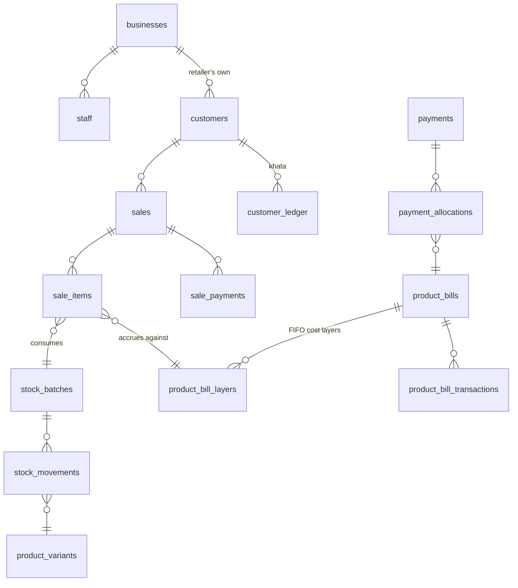

# Target Data Model

The proposed end state, given that **Sledje owns the counter** — the retailer bills their own
customers in Sledje, and that sale is what drives everything else.

This is a design document. Nothing here is built. The path from today's schema is
[13-migration-path.md](13-migration-path.md).

> **The DDL below is presented in narrative order, not dependency order.** Verified to apply
> cleanly on top of the real migrations (`drizzle/0000` → `0002`) on PostgreSQL 15 in this
> order: `businesses`/`staff` → `stock_batches`/`stock_movements` → the `product_bills`
> alterations → `product_bill_layers` → `payments`/`payment_allocations` → the sell-side
> tables → the catalogue changes. Result: 26 tables → 40.

## The two decisions this model is built around

1. **Two-stage product billing.** Delivery records stock *received* — unsold consignment the
   distributor is financing, visible to both parties. The amount becomes *due* when the POS
   records a sale.
2. **FIFO cost layers.** Each delivery is a layer with its own quantity and unit cost. Sales
   consume layers oldest-first, and the accrual is priced from the layers actually consumed.

Together these make the question *"what do I owe for what I've sold?"* answerable — which is
the question product-based billing exists to answer, and which the current schema cannot.

---

## Shape



---

## Product billing (evolves `product_bills`)

The grain stays **(retailer, distributor, variant)**. The balance splits in two.

```sql
ALTER TABLE product_bills
  ADD COLUMN qty_received_unsold      integer       NOT NULL DEFAULT 0,
  ADD COLUMN amount_received_not_due  numeric(14,2) NOT NULL DEFAULT 0,
  ADD COLUMN qty_sold                 integer       NOT NULL DEFAULT 0;
  -- total_amount_due now means "accrued by sale", not "received"
  -- outstanding_balance = amount_due - amount_paid

-- The constraints the current table is missing:
ALTER TABLE product_bills
  ADD CONSTRAINT uq_product_bill UNIQUE (retailer_id, distributor_id, variant_id),
  ADD CONSTRAINT fk_pb_retailer    FOREIGN KEY (retailer_id)    REFERENCES retailers(id),
  ADD CONSTRAINT fk_pb_distributor FOREIGN KEY (distributor_id) REFERENCES distributors(id),
  ADD CONSTRAINT fk_pb_variant     FOREIGN KEY (variant_id)     REFERENCES product_variants(id);
```

`current_unit_cost` is **retired** — it is the column that destroys cost history
([11-design-critique.md](11-design-critique.md) §3).

### FIFO cost layers — new

```sql
CREATE TABLE product_bill_layers (
  id              uuid PRIMARY KEY DEFAULT gen_random_uuid(),
  product_bill_id uuid NOT NULL REFERENCES product_bills(id) ON DELETE CASCADE,
  batch_id        uuid REFERENCES stock_batches(id),
  order_id        uuid,
  qty_received    integer       NOT NULL,
  qty_consumed    integer       NOT NULL DEFAULT 0,
  unit_cost       numeric(12,2) NOT NULL,
  received_at     timestamp     NOT NULL DEFAULT now(),
  CONSTRAINT ck_layer_consumed CHECK (qty_consumed <= qty_received)
);
CREATE INDEX idx_pbl_fifo ON product_bill_layers (product_bill_id, received_at);
```

One row per delivery. `qty_received - qty_consumed` is the unsold remainder of that layer.

### Transaction types

`product_bill_transactions.type` gains two values:

| Type | When | Effect on the bill |
|---|---|---|
| `receipt` | Delivery confirmed | `qty_received_unsold` ↑, `amount_received_not_due` ↑, new layer |
| `accrual` | POS records a sale | `qty_sold` ↑, `total_amount_due` ↑, `amount_received_not_due` ↓, layers consumed |
| `payment` | Retailer pays | `total_amount_paid` ↑, `outstanding_balance` ↓ |
| `return` | Goods returned to distributor | Reverses a receipt; un-consumes layers |
| `adjustment` | Manual correction | Explicit, audited |

### Worked example

Receive 50 @ ₹10, receive 50 @ ₹12, sell 60, pay ₹500:

```
Layers after receipts:
  L1: qty_received 50, unit_cost 10.00, qty_consumed  0
  L2: qty_received 50, unit_cost 12.00, qty_consumed  0

Sell 60 -> FIFO consumes L1 (50 @ ₹10 = ₹500) + L2 (10 @ ₹12 = ₹120)
  L1: qty_consumed 50   (exhausted)
  L2: qty_consumed 10   (40 remaining)

Bill state:
  qty_sold                60      total_amount_due          ₹620
  qty_received_unsold     40      amount_received_not_due   ₹480
  total_amount_paid              ₹500
  outstanding_balance            ₹120

  Check: ₹620 + ₹480 = ₹1,100 = (50 × 10) + (50 × 12)   ✓
  Total exposure to distributor: ₹120 due + ₹480 consignment = ₹600
```

The current implementation produces ₹720 for the accrual (60 × the overwritten ₹12) and has no
concept of the ₹480 consignment split.

---

## Payment allocation — new

Product bills remain the ledger of record. A lump-sum payment is allocated across them.

```sql
CREATE TABLE payments (
  id              uuid PRIMARY KEY DEFAULT gen_random_uuid(),
  retailer_id     uuid NOT NULL REFERENCES retailers(id),
  distributor_id  uuid NOT NULL REFERENCES distributors(id),
  amount          numeric(14,2) NOT NULL CHECK (amount > 0),
  method          text NOT NULL,               -- cash | upi | bank | gateway
  gateway_ref     text,
  allocation_policy text NOT NULL DEFAULT 'oldest_first',
  created_at      timestamp NOT NULL DEFAULT now()
);

CREATE TABLE payment_allocations (
  id              uuid PRIMARY KEY DEFAULT gen_random_uuid(),
  payment_id      uuid NOT NULL REFERENCES payments(id) ON DELETE CASCADE,
  product_bill_id uuid NOT NULL REFERENCES product_bills(id),
  amount          numeric(14,2) NOT NULL CHECK (amount > 0)
);
```

`party_accounts` is a **derived view**, not a table — the retailer↔distributor roll-up is
`SUM` over their product bills. Making it a view keeps product bills authoritative.

Allocation policies: `oldest_first`, `proportional` (to amount due), `sell_through`
(prioritise fast-moving SKUs), `directed` (explicit per-bill split from the client).

---

## Sell-side — all new

```sql
CREATE TABLE customers (
  id            uuid PRIMARY KEY DEFAULT gen_random_uuid(),
  retailer_id   uuid NOT NULL REFERENCES retailers(id) ON DELETE CASCADE,
  name          text,
  phone         text,
  credit_limit  numeric(12,2) DEFAULT 0,
  created_at    timestamp NOT NULL DEFAULT now(),
  CONSTRAINT uq_customer_phone UNIQUE (retailer_id, phone)
);

CREATE TABLE sales (
  id             uuid PRIMARY KEY,             -- client-generated ULID, see Offline
  retailer_id    uuid NOT NULL REFERENCES retailers(id),
  customer_id    uuid REFERENCES customers(id),   -- NULL = walk-in
  staff_id       uuid REFERENCES staff(id),
  bill_number    text NOT NULL,
  sold_at        timestamp NOT NULL,
  subtotal       numeric(12,2) NOT NULL,
  tax_total      numeric(12,2) NOT NULL DEFAULT 0,
  discount       numeric(12,2) NOT NULL DEFAULT 0,
  total          numeric(12,2) NOT NULL,
  status         text NOT NULL DEFAULT 'completed',  -- completed | voided
  client_id      text NOT NULL,                -- device id, for idempotent sync
  synced_at      timestamp,
  CONSTRAINT uq_sale_bill UNIQUE (retailer_id, bill_number)
);

CREATE TABLE sale_items (
  id            uuid PRIMARY KEY DEFAULT gen_random_uuid(),
  sale_id       uuid NOT NULL REFERENCES sales(id) ON DELETE CASCADE,
  variant_id    uuid NOT NULL REFERENCES product_variants(id),
  batch_id      uuid REFERENCES stock_batches(id),
  layer_id      uuid REFERENCES product_bill_layers(id),   -- which cost layer it consumed
  quantity      integer NOT NULL,
  unit_price    numeric(10,2) NOT NULL,        -- what the customer paid
  unit_cost     numeric(12,2) NOT NULL,        -- from the consumed layer
  tax_rate      numeric(5,2) NOT NULL DEFAULT 0,
  amount        numeric(12,2) NOT NULL
);

CREATE TABLE sale_payments (
  id         uuid PRIMARY KEY DEFAULT gen_random_uuid(),
  sale_id    uuid NOT NULL REFERENCES sales(id) ON DELETE CASCADE,
  method     text NOT NULL,                    -- cash | upi | card | credit
  amount     numeric(12,2) NOT NULL
);

CREATE TABLE customer_ledger (
  id           uuid PRIMARY KEY DEFAULT gen_random_uuid(),
  retailer_id  uuid NOT NULL REFERENCES retailers(id),
  customer_id  uuid NOT NULL REFERENCES customers(id),
  type         text NOT NULL,                  -- debit | credit
  amount       numeric(12,2) NOT NULL,
  balance      numeric(12,2) NOT NULL,
  sale_id      uuid REFERENCES sales(id),
  created_at   timestamp NOT NULL DEFAULT now()
);

CREATE TABLE day_close (
  id             uuid PRIMARY KEY DEFAULT gen_random_uuid(),
  retailer_id    uuid NOT NULL REFERENCES retailers(id),
  business_date  date NOT NULL,
  opening_float  numeric(12,2) NOT NULL DEFAULT 0,
  expected_cash  numeric(12,2) NOT NULL,
  counted_cash   numeric(12,2) NOT NULL,
  variance       numeric(12,2) GENERATED ALWAYS AS (counted_cash - expected_cash) STORED,
  closed_at      timestamp NOT NULL DEFAULT now(),
  CONSTRAINT uq_day_close UNIQUE (retailer_id, business_date)
);
```

**`sale_payments` is a separate table on purpose** — partial and split payment ("₹200 cash,
₹300 UPI, ₹100 on khata") is the normal case in a kirana shop, not an edge case.

---

## Stock — replaces three tables

```sql
CREATE TABLE stock_batches (
  id           uuid PRIMARY KEY DEFAULT gen_random_uuid(),
  owner_type   text NOT NULL,                  -- retailer | distributor
  owner_id     uuid NOT NULL,
  variant_id   uuid NOT NULL REFERENCES product_variants(id),
  lot_code     text,
  expiry       date,
  landed_cost  numeric(12,2) NOT NULL DEFAULT 0,
  received_at  timestamp NOT NULL DEFAULT now()
);
CREATE INDEX idx_batch_owner ON stock_batches (owner_type, owner_id, variant_id, expiry);

CREATE TABLE stock_movements (
  id          uuid PRIMARY KEY DEFAULT gen_random_uuid(),
  owner_type  text NOT NULL,
  owner_id    uuid NOT NULL,
  variant_id  uuid NOT NULL REFERENCES product_variants(id),
  batch_id    uuid REFERENCES stock_batches(id),
  type        text NOT NULL,   -- purchase_in | sale_out | return_in | return_out
                               -- | damage | expiry_writeoff | stocktake_adjust | transfer
  quantity    integer NOT NULL,               -- signed: +in, -out
  ref_type    text,                           -- sale | order | adjustment
  ref_id      uuid,
  created_at  timestamp NOT NULL DEFAULT now(),
  created_by  uuid REFERENCES staff(id)
);
CREATE INDEX idx_movement_position ON stock_movements (owner_type, owner_id, variant_id);
```

On-hand is **derived**: `SUM(quantity)` grouped by (owner, variant, batch), materialised into
`stock_positions` if read performance demands it. This replaces `distributor_inventory.stock`,
`inventory.qty` and all of `retailer_inventory`.

Note `stock_batches` and `product_bill_layers` are linked, so a batch's expiry and its cost
layer stay consistent — expiry management and FIFO costing are the same fact viewed twice.

---

## Catalogue

```sql
ALTER TABLE product_variants
  ADD COLUMN barcode           text,
  ADD COLUMN pack_size         numeric(10,3),
  -- denormalised from products, so SKU uniqueness can be scoped without a subquery
  -- (Postgres does not permit subqueries in index expressions)
  ADD COLUMN distributorship_id uuid REFERENCES distributorships(id),
  DROP CONSTRAINT product_variants_sku_unique;

CREATE UNIQUE INDEX uq_variant_barcode
  ON product_variants (barcode) WHERE barcode IS NOT NULL;

CREATE UNIQUE INDEX uq_variant_sku_scoped
  ON product_variants (distributorship_id, sku);

-- The retailer's own selling price, which does not exist today:
CREATE TABLE retail_prices (
  id          uuid PRIMARY KEY DEFAULT gen_random_uuid(),
  retailer_id uuid NOT NULL REFERENCES retailers(id) ON DELETE CASCADE,
  variant_id  uuid NOT NULL REFERENCES product_variants(id),
  price       numeric(10,2) NOT NULL,
  updated_at  timestamp NOT NULL DEFAULT now(),
  CONSTRAINT uq_retail_price UNIQUE (retailer_id, variant_id)
);
```

---

## Identity

```sql
CREATE TABLE businesses (
  id            uuid PRIMARY KEY DEFAULT gen_random_uuid(),
  type          text NOT NULL,                 -- retailer | distributor
  name          text NOT NULL,
  owner_name    text NOT NULL,
  gst_number    text,
  business_type text NOT NULL,
  pincode       text NOT NULL,
  state         text,
  address       text,
  created_at    timestamp NOT NULL DEFAULT now()
);

CREATE TABLE staff (
  id          uuid PRIMARY KEY DEFAULT gen_random_uuid(),
  business_id uuid NOT NULL REFERENCES businesses(id) ON DELETE CASCADE,
  user_id     uuid NOT NULL REFERENCES users(id) ON DELETE CASCADE,
  role        text NOT NULL,                   -- owner | manager | cashier
  created_at  timestamp NOT NULL DEFAULT now(),
  CONSTRAINT uq_staff UNIQUE (business_id, user_id)
);
```

**The JWT gains `businessId`** alongside `id` and `role`. That single change removes the
per-request profile lookup, fixes the ledger `entityId` filter, and fixes Socket.IO room
targeting — three defects with one claim.

`retailers` and `distributors` become views over `businesses` during migration so existing
queries keep working.

---

## Offline

The POS must bill customers without a network.

| Concern | Decision |
|---|---|
| Identifiers | **Client-generated ULIDs** for `sales` and `sale_items`. Monotonic, sortable, collision-free across devices; no server round-trip to start a bill. |
| Queue | An append-only outbox on the device. Sales are queued locally and pushed when connectivity returns. |
| Ingest | **Idempotent**, keyed on `(client_id, sale.id)`. Replaying the queue is safe. |
| Conflicts | **Sales are immutable once synced.** A correction is a new movement (a void plus a re-bill, or a `return_in`), never an edit. This is the same append-only discipline as the stock and money ledgers. |
| Stock | The device may oversell against stale stock. Accept it: record the sale, let on-hand go negative, and surface a reconciliation prompt. Refusing the sale is worse than a negative number. |
| Prices | Cache `retail_prices` on the device; a price change mid-offline applies to the next sale, not retroactively. |

Practically this means the frontend becomes a PWA with IndexedDB, and the sync endpoint accepts
a batch of sales rather than one at a time.

---

## What this replaces

| Today | Target |
|---|---|
| `distributor_inventory.stock`, `inventory.qty`, `retailer_inventory` | `stock_movements` + `stock_batches` (+ derived `stock_positions`) |
| `product_bills.current_unit_cost` | `product_bill_layers` |
| `inventory.expiry`, `distributor_inventory.expiry` | `stock_batches.expiry` |
| `inventory.daily_avg_sales` (always 0) | Derived from `sale_items` |
| `inventory_snapshots` (never written) | Derived from `stock_movements` at any point in time |
| `POST /product-bills/:billId/pay` only | `payments` + `payment_allocations` |
| `retailers` + `distributors` | `businesses` + `staff` |
| Nothing | `customers`, `sales`, `sale_items`, `sale_payments`, `customer_ledger`, `day_close`, `retail_prices` |
