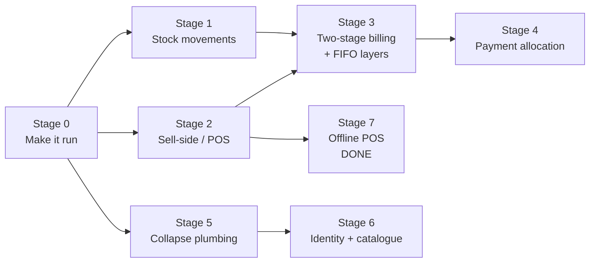

# Migration Path

From today's schema ([04-data-model.md](04-data-model.md)) to
[12-target-model.md](12-target-model.md), in stages that each ship independently.

**Sequencing rule:** every stage must leave the system working. Stage 0 is non-negotiable —
no migration is honest until the current system runs, because you cannot verify a backfill
against a flow that throws.

---

## Stage 0 — Make it run

**Goal:** clear the P0 register in [10-known-issues.md](10-known-issues.md).

No schema change. Mostly mechanical:

1. **The non-Drizzle idiom** (P0-1 … P0-9) — nine sites, one pattern. `col.eq(x)` → `eq(col, x)`,
   `col.in(xs)` → `inArray(col, xs)`, `query.and(...)` → `and(...)` inside one `.where()`.
2. **Controller↔service mismatches** (P0-10 … P0-12) — rename the calls or add the methods.
   Decide whether `getProductsFromConnectedDistributors` should exist at all.
3. **The event chain** (P0-13 … P0-17) — but see Stage 5: much of this disappears rather than
   getting fixed. Do the minimum to make delivery→billing work, then revisit.
4. **Packaging** (P4-1, P4-2) — add `cors` and `minimist` to `package.json`. P4-1 is a latent
   production outage: a clean `npm ci` can fail to resolve `cors` and the server will not boot.
5. **Error middleware** (P1-5) — one handler mapping domain errors to status codes. This makes
   every subsequent stage debuggable; do it early.

**Verification:** register → connect → add catalogue item → order → accept → complete →
observe a `product_bills` row and a `ledger` row. That full path currently cannot complete.

**Rollback:** per-fix; nothing is destructive.

**Closes:** all P0, P1-5, P4-1, P4-2.

---

## Stage 1 — Stock as movements

**Goal:** on-hand becomes derived, not mutated.

1. Create `stock_batches` and `stock_movements`.
2. **Backfill**, in this order:
   - One `stock_batches` row per existing `distributor_inventory` row (expiry, cost) and per
     `inventory` row.
   - One opening `stock_movements` row of type `stocktake_adjust` per current position, so
     `SUM(quantity)` reproduces today's `stock` / `qty` exactly.
   - Replay `product_delivery_log` into `purchase_in` movements where you want history — this
     table is the reliable record of what was actually delivered.
3. **Dual-write** for one release: writes update both the old columns and the new movements.
4. Compare nightly: `SUM(movements)` vs `distributor_inventory.stock` / `inventory.qty`. Cut
   reads over when they agree for a week.
5. Retire `retailer_inventory` — it is append-only garbage from the broken consumer and has no
   trustworthy content; do not backfill from it.

**Rollback:** reads revert to the old columns; dual-write keeps them current.

**Closes:** P2-3, P2-4, P3-10. Prerequisite for Stage 3.

---

## Stage 2 — The sell-side

**Goal:** the system finally learns what the shop sold. This is the stage that makes the
product what it is meant to be.

1. Create `customers`, `sales`, `sale_items`, `sale_payments`, `customer_ledger`, `day_close`,
   `retail_prices`.
2. Build the POS screen. `pages/Retailers/retailerShop.js` and `CreateOrder.js` are the
   existing placeholders — note `CreateOrder.js` is built over a hardcoded catalogue of
   iPhones and should be treated as a UI sketch, not a starting point.
3. Each completed sale writes, in **one transaction**: the `sales` row, its `sale_items`, its
   `sale_payments`, and one `sale_out` movement per line.
4. `inventory.daily_avg_sales` becomes a derived query over `sale_items` rather than a stored
   `0`.

**No billing change yet** — bills still accrue on delivery. Stage 3 flips that, and it needs
this stage's data to exist first.

**Verification:** sell an item; on-hand decreases; a `sale_out` movement exists; day-close
variance computes.

**Rollback:** the POS is additive — disable the screen, nothing else regresses.

**Closes:** the §1 critique. Feeds Stage 3.

---

## Stage 3 — Two-stage billing and FIFO cost layers

**Goal:** deliver what product-based billing was for. Depends on Stages 1 and 2.

1. Create `product_bill_layers`. Add `qty_received_unsold`, `amount_received_not_due`,
   `qty_sold` to `product_bills`. Add the missing FKs and `uq_product_bill`.
2. **Backfill the layers from existing data** — this is the good news: every `delivery` row in
   `product_bill_transactions` already carries its own `unit_price` and `quantity`. One layer
   per delivery transaction, ordered by `date`, reproduces the true cost history that
   `current_unit_cost` was overwriting.
3. **Deduplicate first.** Because `product_bills` has no unique constraint today, check for
   duplicate (retailer, distributor, variant) rows and merge them before adding
   `uq_product_bill`, or the constraint will not apply.
4. Split existing balances: treat everything currently delivered as *sold* (there is no sales
   history before Stage 2), so `qty_sold = total_quantity_delivered` and
   `qty_received_unsold = 0`. This is a deliberate simplification — pre-POS history has no
   sell-through data and inventing one would be worse than a clean cutover.
5. Move the accrual trigger from `inventory.updated_after_order` to the sale event. Delivery
   now writes a `receipt` transaction and a layer; the sale writes an `accrual` and consumes
   layers FIFO.
6. Retire `current_unit_cost`.

**Verification:** the worked example in [12-target-model.md](12-target-model.md) — receive
50 @ ₹10, receive 50 @ ₹12, sell 60, pay ₹500 → due ₹620, consignment ₹480, outstanding ₹120.
Assert those exact numbers in a test.

**Rollback:** keep `current_unit_cost` populated during the transition; the old accrual path
can be re-enabled behind a flag.

**Closes:** critique §2, §3, §7 (partly); P1-15.

---

## Stage 4 — Payment allocation

1. Create `payments` and `payment_allocations`.
2. Add `POST /payments` taking `{ distributorId, amount, method, policy }` and allocating
   across that retailer's bills.
3. Add the party-level statement view (a `SUM` over product bills — a view, not a table, so
   product bills stay authoritative).
4. Keep `POST /product-bills/:billId/pay` as a directed single-bill allocation.
5. Fix the clamp (P1-12) here rather than in Stage 0 if you prefer — allocation makes it
   natural, since the engine already knows each bill's outstanding.

**Closes:** critique §4; P1-12; P3-5 (retire `modules/payments/`, keeping its clamp and ledger
write).

---

## Stage 5 — Collapse the plumbing

**Goal:** stop paying for distributed-systems machinery you do not have a distributed system
for. Can start any time after Stage 0.

1. Move delivery → billing → ledger into **one transaction in the request path**. The consumer
   chain disappears; so do its four dedupe and ordering defects.
2. Keep NATS for genuinely async fan-out only: notifications, realtime push, analytics.
3. **One publish helper.** Delete one of `config/nats-streams.js` / `events/jetstream.js`.
   Prefer the rejecting variant — silent publish failures are how events go missing.
4. **One outbox drain.** Delete either `consumers/outbox.consumer.js` or
   `modules/outbox/outbox.worker.js`. Update `backend/startup.text`.
5. **Remove the best-effort direct publish** that follows every outbox write. The outbox is the
   publish path or it is pointless.
6. Delete both dedupe implementations. Rely on domain uniqueness constraints — the pattern
   `uq_product_delivery_order_bill` already demonstrates.
7. Delete `src/consumers1/`, `backend/realtime/`, `paments.controrer1.js`,
   `utils/invoicePdf.js`, `utils/email.js`, and the zero-byte files. **First** salvage
   `consumers1/notifications.consumer.js` — it is the only code that ever persisted a
   notification row.

**Closes:** critique §9; P0-13 … P0-17; P3-1 … P3-4, P3-6 … P3-9, P3-12.

---

## Stage 6 — Identity and catalogue hygiene

1. **Add `businessId` to the JWT** — do this first and alone. One claim fixes the ledger
   `entityId` filter (P0-23) *and* Socket.IO room targeting (P1-6), and removes a query from
   every authenticated request.
2. Create `businesses` + `staff`; make `retailers` / `distributors` views over `businesses` so
   existing queries keep working; migrate writers gradually.
3. Add `barcode` to `product_variants` with a partial unique index.
4. Rescope SKU uniqueness to the distributorship. **Detect collisions first** — the current
   global constraint means none exist yet, so this is safe to do before any real catalogue
   volume arrives. Doing it later is much harder.
5. Add a distributorship merge path for the typo-forked duplicates that find-or-create creates.

**Closes:** critique §10, §11; P0-23; P1-6.

---

## Stage 7 — Offline POS — **done**

Built out of order: Stage 1 was skipped. See
[16-offline-first.md](16-offline-first.md) for the full record.

1. ✅ `sales.id` (and `sale_items.id`, `sale_payments.id`) are client-generated ULIDs;
   `sales` gained `device_id`, `synced_at`, `voided_at`, `void_reason` — `0008_offline_sync`.
   `client_id` was not needed: `device_id` on the sale plus `sync_ops.device_id` cover it.
2. ✅ PWA with Dexie/IndexedDB and an append-only outbox — `frontend/src/offline/`,
   `vite-plugin-pwa`.
3. ✅ `POST /sync`, idempotent on **`(device_id, op_id)`** rather than `(client_id, sale.id)` —
   op-level, so voids and price changes get the same guarantee sales do.
4. ✅ Sales immutable once synced; the only correction is `sale.void` plus a re-bill.
5. ✅ Negative on-hand is accepted and the POS surfaces a reconciliation prompt.

**Stage 1 was NOT done first, and that has a stated limit.** Sync applies *operations*
(`qty = qty - n`), never absolute state, which is what makes concurrent selling safe under a
mutable counter. Anything that expresses a **level** rather than a change — stock-take above
all — is not safe and must wait for `stock_movements`. Stage 1 is therefore now the gating
dependency for stock-take and reconciliation, not for offline billing. The table in
[16-offline-first.md](16-offline-first.md) ("Where the deferral stops being safe") is the
authority.

**Verification:** `backend/scripts/verify_offline_sync.js` (42 assertions against a real
database, including docs/02's worked example driven through the sync path) plus a
Playwright run in real Chrome (31 assertions, real service worker, network genuinely cut).

**Closes:** critique §12.

---

## Sequencing summary

| Stage | Depends on | Ships | Risk |
|---|---|---|---|
| 0 Make it run | — | A working system | Low — mechanical |
| 1 Stock movements | 0 | Audit trail, correct concurrency | Medium — backfill |
| 2 Sell-side | 0 | **The actual product** | Medium — new surface |
| 3 Two-stage billing | 1, 2 | The differentiator, working | **High** — money migration |
| 4 Payment allocation | 3 | Usable settlement | Low |
| 5 Collapse plumbing | 0 | Debuggable system, less code | Medium — behaviour move |
| 6 Identity + catalogue | 0 (step 1 anytime) | Three bug fixes, one claim | Low → Medium |
| 7 Offline POS | 2 | Works without network | High |

If only two stages ever happen, make them **0 and 2**. Stage 0 gives you a system that runs;
Stage 2 gives you the one thing the product is missing.
