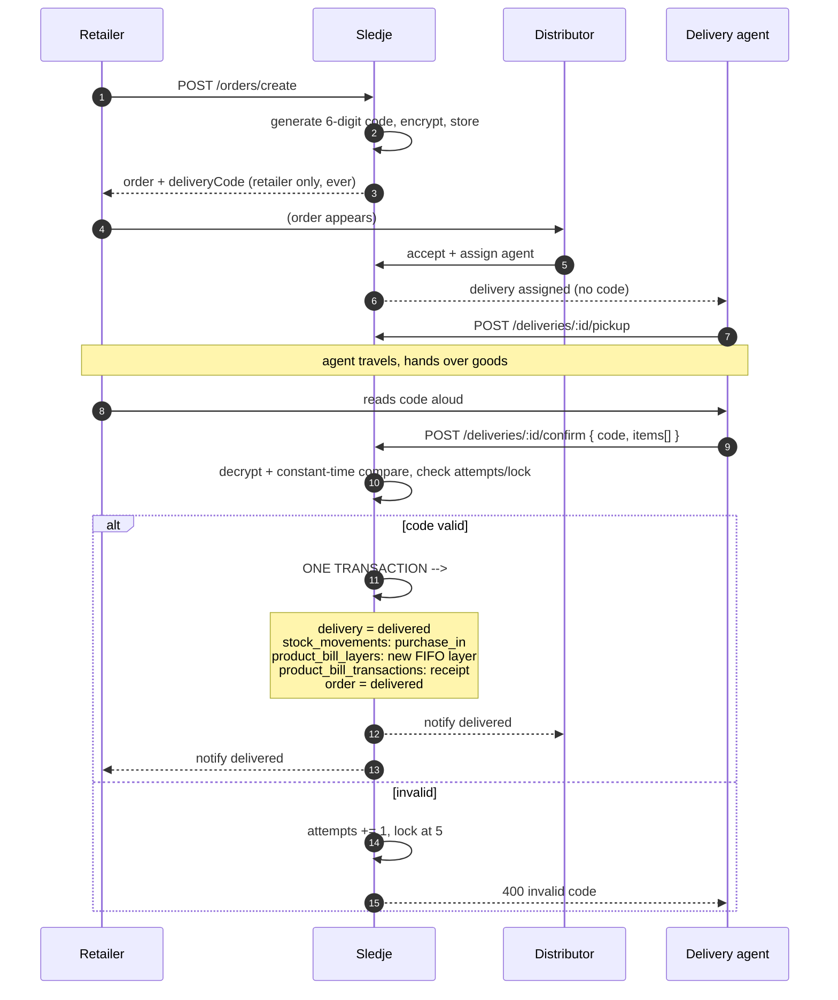
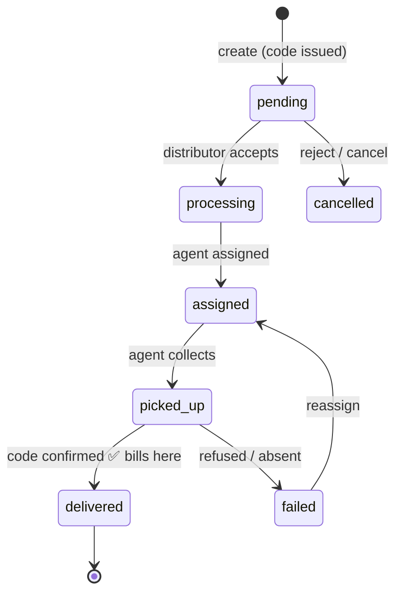

# Delivery Confirmation

**Design document — not yet built.**

## The requirement

Delivery is confirmed by a **third party**, the delivery agent — neither retailer nor
distributor. A **code is generated when the retailer creates the order** and is held by the
**retailer only**. The agent confirms delivery by presenting that code, which the retailer
gives them at the doorstep.

## Why this matters more than it looks

This is not just a status field. It is the **trust anchor for the entire money model**.

Today, `completeOrder` accepts a `code` argument and never checks it
(`// For now, assume code matches.`, P1-14). The retailer marks their own order complete, and
that unverified self-attestation is what fires the billing chain. Two failure modes follow:

- A retailer who never marks complete is **never billed** — the distributor's goods are gone
  and no liability exists.
- Nothing distinguishes "delivered" from "claimed delivered".

A retailer-held code presented by an independent agent turns delivery into a **two-party
attestation**: the agent asserts they delivered, the retailer's code proves they received.
Neither party can produce it alone. That is a far stronger event to hang a debt on, and it is
the right trigger for the `receipt` transaction in
[02-product-billing.md](02-product-billing.md).

## Actors

`users.role` gains a third value: **`delivery_agent`**.

An agent may be employed by a distributor or operate independently
(`employed_by_distributor_id` nullable). Either way they are a distinct principal with their
own login — a distributor cannot confirm a delivery, and neither can a retailer.

## Schema

```sql
-- 1. The third actor
CREATE TABLE delivery_agents (
  id                        uuid PRIMARY KEY DEFAULT gen_random_uuid(),
  user_id                   uuid NOT NULL UNIQUE REFERENCES users(id) ON DELETE CASCADE,
  name                      text NOT NULL,
  phone                     text NOT NULL,
  vehicle_number            text,
  operating_pincode         text,
  employed_by_distributor_id uuid REFERENCES distributors(id),  -- NULL = independent
  active                    boolean NOT NULL DEFAULT true,
  created_at                timestamp NOT NULL DEFAULT now()
);

-- 2. A delivery run. One order may need more than one (partial / split delivery).
CREATE TABLE deliveries (
  id             uuid PRIMARY KEY DEFAULT gen_random_uuid(),
  order_id       uuid NOT NULL REFERENCES orders(id),
  agent_id       uuid REFERENCES delivery_agents(id),
  status         text NOT NULL DEFAULT 'assigned',
                 -- assigned | picked_up | in_transit | delivered | failed | returned
  assigned_at    timestamp,
  picked_up_at   timestamp,
  delivered_at   timestamp,
  failure_reason text,
  confirmed_by   uuid REFERENCES delivery_agents(id),   -- who submitted the code
  created_at     timestamp NOT NULL DEFAULT now()
);
CREATE INDEX idx_deliveries_order ON deliveries (order_id);
CREATE INDEX idx_deliveries_agent ON deliveries (agent_id, status);

-- 3. What was actually accepted, line by line. Drives billing.
CREATE TABLE delivery_items (
  id            uuid PRIMARY KEY DEFAULT gen_random_uuid(),
  delivery_id   uuid NOT NULL REFERENCES deliveries(id) ON DELETE CASCADE,
  order_item_id uuid NOT NULL REFERENCES order_items(id),
  variant_id    uuid NOT NULL REFERENCES product_variants(id),
  qty_sent      integer NOT NULL,
  qty_accepted  integer NOT NULL DEFAULT 0,
  qty_rejected  integer NOT NULL DEFAULT 0,
  reject_reason text,
  CONSTRAINT ck_delivery_qty CHECK (qty_accepted + qty_rejected <= qty_sent)
);

-- 4. The code. One per order, created with the order, held by the retailer.
CREATE TABLE order_delivery_codes (
  order_id     uuid PRIMARY KEY REFERENCES orders(id) ON DELETE CASCADE,
  code_enc     bytea NOT NULL,          -- AES-256-GCM ciphertext
  code_iv      bytea NOT NULL,
  code_tag     bytea NOT NULL,
  attempts     integer NOT NULL DEFAULT 0,
  locked_until timestamp,
  consumed_at  timestamp,
  consumed_by  uuid REFERENCES delivery_agents(id),
  created_at   timestamp NOT NULL DEFAULT now()
);
```

### Why encrypted rather than hashed

A hash is the reflex, but it is wrong here: **the retailer must be able to read the code back**.
A kirana owner who created an order on Monday will not have written down a six-digit number by
Thursday, and "shown once, then lost forever" makes the feature unusable.

So the code is stored **encrypted at rest** (AES-256-GCM, key from `DELIVERY_CODE_KEY`) and
decrypted only for:

- the authenticated retailer who owns the order, on `GET /orders/retailer/orders/:id`, and
- server-side comparison during confirmation.

A database dump alone does not yield usable codes. That is the property that matters; hashing
would buy a little more at the cost of the feature working.

> If you would rather hash: keep `code_hash`, and give the retailer a "resend code" action that
> generates a *new* code and invalidates the old one. That is also defensible — it trades a
> round trip for a stronger at-rest posture. Pick one deliberately.

### Brute force

Six digits is 10⁶. Without a limit an agent could grind a code in hours.

- **5 attempts**, then `locked_until = now() + 15 minutes`, escalating on repeat.
- Attempts are counted **per order**, not per agent, so switching accounts does not reset them.
- A lockout notifies the distributor and the retailer.
- Codes expire when the order is cancelled, and are single-use (`consumed_at`).

Consider 8 digits or alphanumeric if agents are untrusted; six is fine when the agent is also
identified and the attempt is logged against them.

## Flow



## Endpoints

| Method | Path | Actor | Purpose |
|---|---|---|---|
| POST | `/orders/create` | retailer | Returns `deliveryCode` in the response |
| GET | `/orders/retailer/orders/:id` | retailer | Includes `deliveryCode` — **retailer only** |
| POST | `/deliveries` | distributor | Create a run, assign an agent |
| GET | `/deliveries/mine` | agent | Assigned runs — **never includes the code** |
| POST | `/deliveries/:id/pickup` | agent | Mark picked up |
| POST | `/deliveries/:id/confirm` | agent | `{ code, items: [{orderItemId, qtyAccepted, qtyRejected}] }` |
| POST | `/deliveries/:id/fail` | agent | Retailer refused / absent — no code, no billing |

**The code must never appear** in a distributor response, an agent response, a notification, a
socket payload, a log line, or an error message. Add a test asserting exactly that — it is the
kind of leak that arrives later via a convenience field on a list endpoint.

## Partial acceptance

`delivery_items.qty_accepted` is what bills, not `qty_sent`. If a retailer accepts 8 of 10
because two are damaged, the product bill receives a layer of **8** and the order retains a
shortfall of 2 for the distributor to resolve. This is only expressible because billing is
per-product ([02-product-billing.md](02-product-billing.md)); an order-level invoice would
have to be credit-noted.

## Order state machine, revised



**`completeOrder` is removed.** A retailer can no longer self-attest delivery; `delivered` is
reachable only through a validated code. This closes P1-14.

## What this changes elsewhere

| Area | Change |
|---|---|
| Billing trigger | `orders.completed` → delivery confirmation, in the same transaction ([14-simplification.md](14-simplification.md)) |
| `orders.accepted_at` / `delivered_at` | Finally written — currently declared and never set |
| Auth | `requireRole('delivery_agent')`; the agent sees only their own runs |
| Offline | The agent app needs offline confirmation — see [16-offline-first.md](16-offline-first.md) |
| Frontend | A third app surface: the agent's run list and confirm screen |

## Open questions

1. **Who onboards agents?** Distributor-managed is simplest to ship; a platform-level pool
   needs vetting, ratings and dispute handling.
2. **Multi-drop runs** — one agent, many orders, one trip. The schema supports it (`deliveries`
   is per order), but the agent UI should batch by route.
3. **Cash on delivery.** If agents collect payment, `deliveries` needs `cash_collected` and a
   settlement flow between agent and distributor. Not modelled here — decide before building.
4. **Proof beyond the code** — photo, signature, GPS at confirmation. Cheap to add now
   (`deliveries.proof_url`, `confirmed_lat/lng`), expensive to retrofit.
