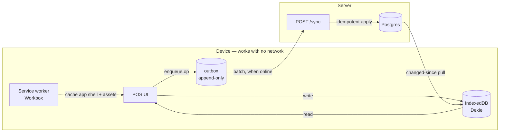

# Offline-First

**Design document — not yet built.**

## Why this is not optional

A kirana counter has intermittent connectivity. If billing a customer stops when the network
does, the shopkeeper reaches for the notebook — and does not come back. Offline capability is
the difference between software a shop *uses* and software a shop *tried*.

It is also far cheaper to decide now. The sell-side does not exist yet
([12-target-model.md](12-target-model.md)), so its schema and API can be designed
sync-friendly from the first line. Retrofitting offline onto a server-authoritative POS means
rewriting it.

## What must work offline, and what must not

Not everything deserves the complexity. Be deliberate:

| Capability | Offline? | Why |
|---|---|---|
| **Bill a customer (POS)** | **Must** | The whole argument. A sale must never be blocked. |
| **View shelf / stock / prices** | **Must** | Read cache; useless if it needs the network |
| **Add a customer, record khata payment** | **Must** | Part of the counter flow |
| **Day close** | **Must** | Happens at closing time, often on a dying connection |
| **Delivery confirmation (agent app)** | **Should** | Agents are outdoors on mobile data — see below |
| **Order to distributor** | **Should queue** | Not urgent, but should not fail; queue and send |
| **Catalogue browse / search** | Partial | Cache what the retailer stocks; full search needs the server |
| **Connections, distributor discovery** | **No** | Inherently online, and rare |
| **Payments to distributor** | **No** | Money movement must be server-authoritative |
| **Invoices / GST documents** | **No** | Statutory, server-generated |

## Architecture



## The five decisions that make it work

### 1. Client-generated identifiers

Sales get **ULIDs generated on the device**, never server-assigned ids.

```js
import { ulid } from "ulid";
const saleId = ulid();   // 01JQ... — sortable, monotonic, collision-free across devices
```

Without this, a sale cannot exist until the server responds — which is precisely what offline
means it cannot do. ULID over UUIDv4 because it sorts by creation time, which makes sync
ordering and index locality free.

### 2. An append-only device outbox

Every mutation is an **operation record**, not a state diff:

```js
// Dexie schema
db.version(1).stores({
  sales:        "id, soldAt, syncState",
  saleItems:    "id, saleId",
  salePayments: "id, saleId",
  customers:    "id, phone",
  stockCache:   "variantId",
  priceCache:   "variantId",
  outbox:       "++seq, opId, type, syncState"   // append-only, ordered
});
```

Operations are `sale.create`, `sale.void`, `customer.create`, `khata.payment`,
`day.close`, `order.create`, `delivery.confirm`. Each carries an `opId` (a ULID) and is never
mutated after being written — replay is always safe.

### 3. An idempotent batch sync endpoint

```
POST /sync
{
  "deviceId": "dev_01JQ...",
  "ops": [
    { "opId": "01JQ...", "type": "sale.create", "at": "...", "payload": { ... } },
    { "opId": "01JQ...", "type": "khata.payment", "at": "...", "payload": { ... } }
  ],
  "cursor": "2026-09-07T10:00:00Z"
}
```

Server behaviour:

- **Idempotency by `(device_id, op_id)`** in a `sync_ops` table with a unique constraint.
  A replayed op is acknowledged, not reapplied. This is the same discipline as
  `uq_product_delivery_order_bill` — let the database enforce exactly-once.
- Ops applied **in order**, each in its own transaction. First failure stops the batch and
  returns the failing `opId`, so the device does not skip past it.
- Response carries a new `cursor` plus rows changed since the old one (prices, catalogue,
  order statuses, delivery states) for the device to merge.

Batch, don't drip: a shop coming back online after four hours has hundreds of ops, and one
request per sale will not survive a weak connection.

### 4. Conflict policy — stated, not discovered

The only conflict rules that survive contact with a real shop:

| Situation | Rule |
|---|---|
| A synced sale is edited | **Not allowed.** Sales are immutable once synced. A correction is a **new** op — a void plus a re-bill, or a `return_in` movement. Same append-only discipline as the money ledger. |
| Two devices sell the last unit | **Both sales stand.** On-hand goes negative; the shop is told to reconcile. Refusing a sale that physically happened is worse than a negative number. |
| Price changed on the server mid-offline | The **device's cached price at time of sale** is authoritative for that sale. It is what the customer paid. New price applies to the next sale. |
| Same customer created on two devices | Merge on `(retailer_id, phone)`; the earlier ULID wins the id, the other becomes an alias. |
| Day close submitted twice | Idempotent on `(retailer_id, business_date)` — the existing unique constraint. |

**Never last-write-wins on a sale.** It silently destroys revenue records.

### 5. Stock is derived, which is what makes this tractable

This is why [12-target-model.md](12-target-model.md) moves stock to `stock_movements`. An
append-only movement log **merges without conflict** — two devices each append their own
`sale_out` rows and the sum is correct. A mutable `stock = stock - qty` counter cannot merge:
two offline devices both write `stock = 40` and one sale vanishes.

**Offline-first and the stock-ledger redesign are the same decision.** Doing one without the
other does not work.

## Tooling

| Concern | Choice | Note |
|---|---|---|
| Local database | **Dexie.js** | Best IndexedDB ergonomics; typed tables, live queries via `dexie-react-hooks` |
| Ids | **`ulid`** | Sortable, offline-safe |
| Service worker | **Workbox** | App-shell precache, runtime caching for catalogue images |
| Build / PWA | **Vite + `vite-plugin-pwa`** | See migration note below |
| Background flush | **Background Sync API**, with a fallback | Chrome/Android support is good; Safari has none — fall back to flush on `online` + a 60 s timer + flush on app focus |
| Server dedupe | Postgres unique index | Not an in-memory cache |

### The CRA problem — resolved

The frontend **was** Create React App 5 (deprecated, unmaintained, PWA support removed from the
template). **It is now Vite 6** ([08-frontend.md](08-frontend.md) → Toolchain): `index.html`
relocated to the frontend root, `process.env.REACT_APP_API_URL` → `import.meta.env.VITE_API_URL`,
JSX-in-`.js` handled via the esbuild loader (no file renames), `build.outDir` kept at `build/`,
and `react-scripts test` → Vitest. No `svgr` plugin was needed (zero SVG imports). The next
step here is adding **`vite-plugin-pwa`** for the Workbox service worker.

## The agent app is offline too

A delivery agent standing in a shop doorway is the *most* likely person to have no signal, and
[15-delivery-confirmation.md](15-delivery-confirmation.md) requires server-side code
verification.

Resolution: when a run is assigned, the server issues the agent a **signed delivery token**
containing an HMAC of the code (not the code):

```
token = sign({ deliveryId, codeHmac: HMAC(serverKey, code), exp })
```

The agent's device verifies the entered code against `codeHmac` **locally**, shows success, and
queues a `delivery.confirm` op. The server re-verifies on sync — the offline check is a UX
affordance, not the authority. If the server rejects, the delivery reverts to `picked_up` and
both parties are notified.

Brute-force protection must stay **server-side**; the local check is advisory only, since a
determined agent controls their own device.

## Sequencing

Offline work depends on the sell-side existing, which depends on the system running.

1. **Stage 0** — make it run ([13-migration-path.md](13-migration-path.md)). Nothing below is
   verifiable until order creation works.
2. **Vite migration** — before the POS, not after.
3. **Stage 1** — stock as movements. *Prerequisite:* mutable stock cannot sync.
4. **Stage 2** — the sell-side, built online-first but with ULIDs, op-shaped writes and a
   `/sync`-compatible API from day one. Costs almost nothing; saves the rewrite.
5. **Stage 7** — Dexie, the outbox, the service worker, and the sync loop.

Building Stage 2 with server-assigned ids and REST-shaped mutations, then trying to add offline
in Stage 7, is the single most expensive mistake available here.
